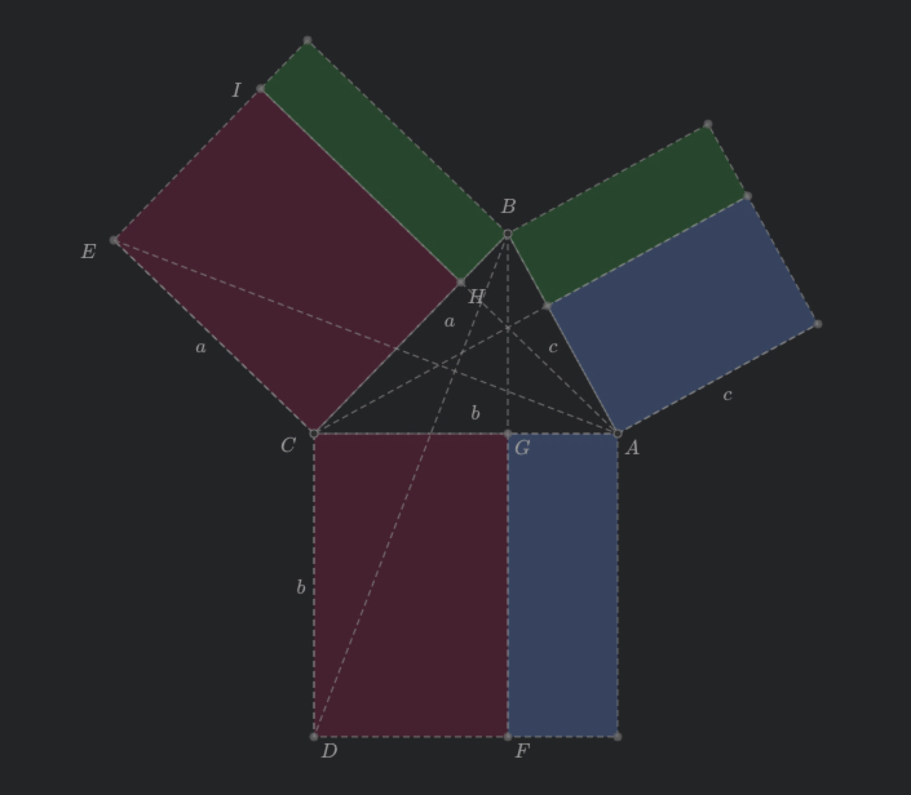
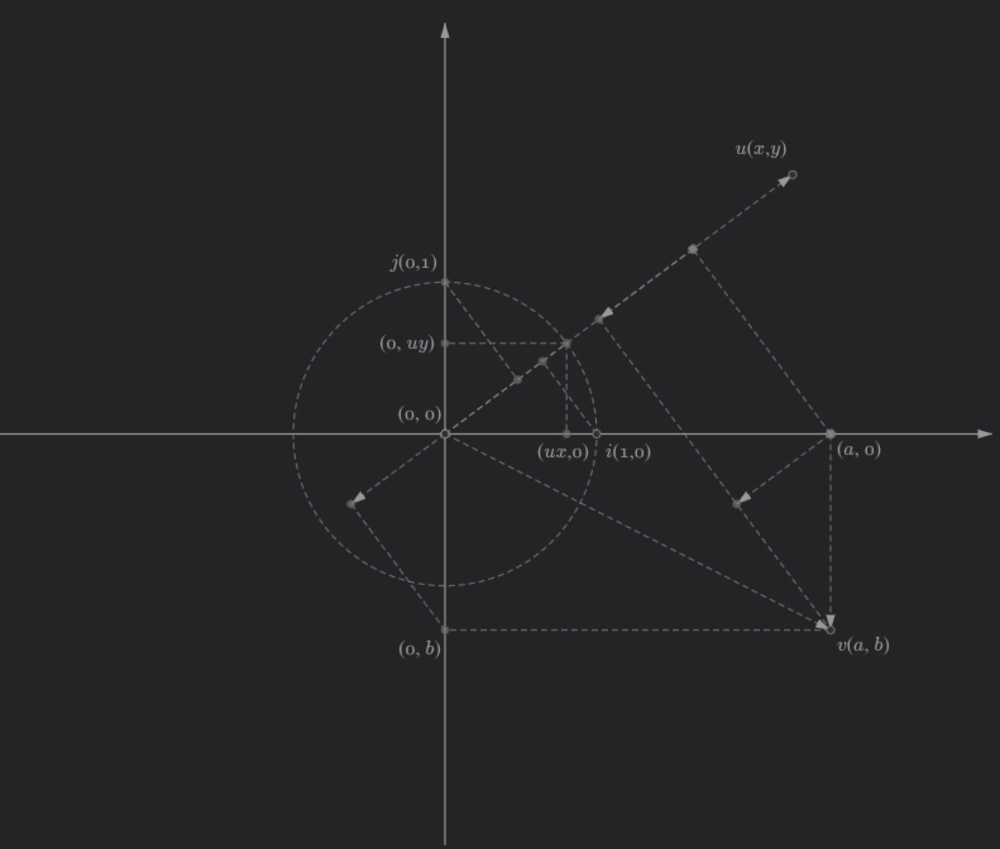

# Fast SVG Geometry Builder (FSG)

Create animatable, customizable style, re-editable and light weight interactive geometry for the web.

## Features

- Extremely fast and light weight geometry construction.
- Hot keys based geometry construction
- Save as Draggable, Selectable, Animatable, Re-editable and Reusable light weight SVG.
- Users can interact with the geometry, not only a static image.
- .svg could be animated with your user script.
- Edit and execute your animate script within the builder. (defulat in vim mode, turn on/off vim mode with F2)
- Runtime supports multiple .svg instances in a single page (fast and light weight).
- LaTeX support.
- Color styles druing the construction or customize with CSS.
- PWA support, you can easily turn the web builder to your local application.
- Export to .html (Inline SVG)

## Demo

### Builder

https://rintaroutw.github.io/fsg

### Screenshots

### Examples Live Demo 

https://rintaroutw.github.io/fsg/example.html

More examples are in `test` folder.

## Code Structure

- common/ : shared definition and helpers.
- components/ : FSG components that managed the svgjs elements within the canvas.
- modules/ : support multiple canvases in a single page. mostly for editor modules.
- `rollup.sh` : use rollup and terser to bundle and minify the editor and runtime code to release.
- `main.js` : the editor's main function.
- `runtime.js` : the runtime's main function.
- `manifest.webmanifest` : support for PWA.
- `index.html` : KaTeX, SVGJS, iro are loaded from CDN.
- `dev.html` : For local development.
- `manifest.webmanifest.dev` : for local development.
- `local-serve.sh` : for local development with the `live-server`

## Dependency

- `SVGJS` for SVG elements
- `svg.pan.zoom` plugin for pan and zoom (it's minor modified for the builder)
- `KaTeX` for LaTeX rendering
- `CodeMirror` for code editing
- `iro` for color picker
- (npm) rollup for js code bundler
- (npm) rollup/plugin-strip for rollup to strip the debug codes.
- (npm) terser for minify code

### Local Development Dependency

- live-server for local web server
  - https.conf.js (need local CA with `mkcert`) : development server to support HTTPS
- https://localhost:8080/dev.html to load manifest.webmanifest.dev(PWA) and main.js (as module)
- `npm install -g rollup` to install rollup
- `npm install -g @rollup/plugin-strip` to install the strip plugin for rollup
- `npm install -g terser` to install the terser that mangle and compress the rolluped code to .min.js.
- modify `DEV_TESTING` to `true` in `common/define.js` to make the generated .svg and .html to load local `runtime.min.js`. BEWARE! it won't load `runtime.js` directly since script in SVG doesn't support modules yet, so we need to run `rollup.sh` to update the runtime.min.js everytime you updated `runtime.js`.

## Why?

I enjoyed Geogebra for a long time, but it's too heavy and slow when embedding multiple instances in a single page.
The runtime of Geogebra is not designed for the web, that makes your work hard to be reused in the web pages.
At the same time, it's kind of too complex for people who is not major in Math.
So I decided to build this builder that I can create the geometry I want in just one minute.
