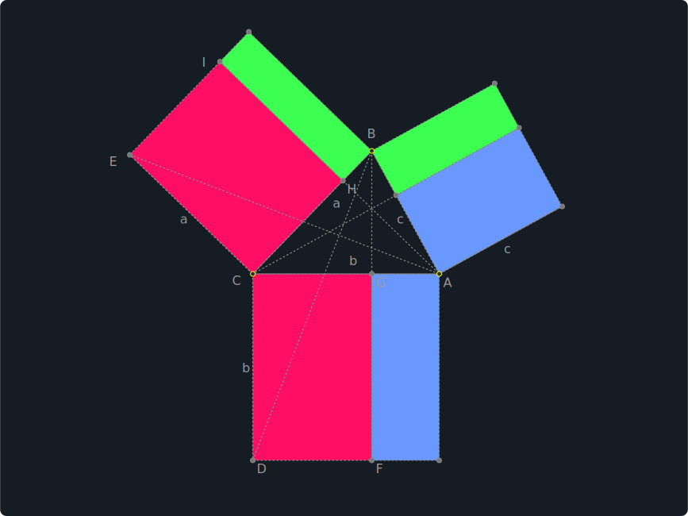
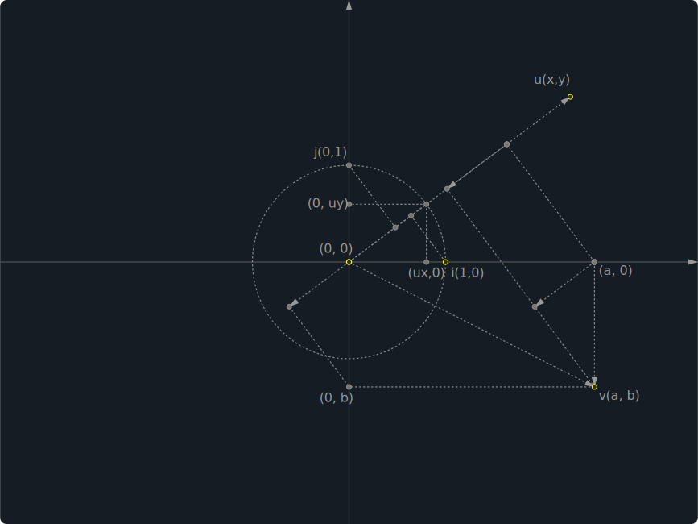

# Fast SVG Geometry Builder (FSG)

Create animatable, customizable style, re-editable and light weight interactive geometry for the web.

## Features

- Extremely fast and light weight geometry construction.
- Hot keys based geometry construction
- Save as Draggable, Selectable, Animatable, Re-editable and Reusable light weight SVG.
- Users can interact with the geometry, not only a static image.
- .svg could be animated with your user script.
- Edit and execute your animate script within the builder. (defulat in vim mode, turn on/off vim mode with F2)
- Runtime supports multiple .svg instances in a single page (fast and light weight).
- LaTeX support.
- Color styles druing the construction or customize with CSS.
- PWA support, you can easily turn the web builder to your local application.
- Export to .html (Inline SVG)

## Demo

### Builder

https://rintaroutw.github.io/fsg


### Examples Live Demo 






https://rintaroutw.github.io/fsg/example.html

There're over 60 examples are in `test` folder.

## Different ways to show SVG

### Standalone SVG

Using browser to open .svg directly, the svg would load the runtime automatically.

### Load multiple .svg files in a page at the same time.

Using `<fsg src='foo.svg'>` custom tag, the runtime would load all of them for you.

```
<!DOCTYPE html>
<html lang="eng">
<head>
  <title>Fast SVG Geometry</title>
  <link rel="stylesheet" href="https://cdn.jsdelivr.net/npm/katex@0.12.0/dist/katex.min.css">
  <link rel="stylesheet" type="text/css" href="https://rintaroutw.github.io/fsg/style/runtime.css">
  <script defer src="https://cdn.jsdelivr.net/npm/@svgdotjs/svg.js@3.0/dist/svg.min.js"></script>
  <script defer type="module" src="https://rintaroutw.github.io/fsg/runtime.min.js"></script>
</head>
<body>
  <center>
  <fsg title="example 1" src="test/dot-product-geo0.svg"></fsg>
  <fsg title="example 2" src="test/dot-product-geo1.svg"></fsg>
  <fsg title="example 3" src="test/determinant-2.svg"></fsg>
  <fsg title="example 4" src="test/dot-product-coordinate-2.svg"></fsg>
  <fsg title="example 5" src="test/Projection.svg"></fsg>
  <fsg title="example 6" src="test/law-of-sines.svg"></fsg>
  <fsg title="example 7" src="test/law-of-cosines.svg"></fsg>
  <fsg title="example 8" src="test/9pointsCircle.svg"></fsg>
  <fsg title="example 9" src="test/HeronFormula.svg"></fsg>
  <fsg title="example 10" src="test/Trapezoid.svg"></fsg>
  <fsg title="example 11" src="test/dot-product.svg"></fsg>
  </center>
</body>
</html>
```

`title` is optional, if it's specified, the runtime would show it at the bottom.

### Loaded as a static image

```

```

Loaded as a static image, it won't be interactive since the runtime won't be loaded by the browser.
The demo screenshots listed above are exactly this way, it's convinient when u need thumbnails/screenshots without image capture/conversion. Just let the browser generate them for you at the runtime.

### Load with `<iframe>`

```
<iframe src='foo.svg' title='hello world'></iframe>
```

For the case you want to use `<iframe>` in your .html or other documentation website.
It's also supported and it would work just like custome `<fsg>` tag.

`title` is optional, if it's specified, the runtime would show it at the bottom.

### Embedding in .html

`Export to HTML` would generate the .html, and the svg was embedded in it.

## Code Structure

- common/ : shared definition and helpers.
- components/ : FSG components that managed the svgjs elements within the canvas.
- modules/ : support multiple canvases in a single page. mostly for editor modules.
- `rollup.sh` : use rollup and terser to bundle and minify the editor and runtime code to release.
- `main.js` : the editor's main function.
- `runtime.js` : the runtime's main function.
- `manifest.webmanifest` : support for PWA.
- `index.html` : KaTeX, SVGJS, iro are loaded from CDN.
- `dev.html` : For local development.
- `manifest.webmanifest.dev` : for local development.
- `local-serve.sh` : for local development with the `live-server`

## Dependency

- `SVGJS` for SVG elements
- `svg.pan.zoom` plugin for pan and zoom (it's minor modified for the builder)
- `KaTeX` for LaTeX rendering
- `CodeMirror` for code editing
- `iro` for color picker
- (npm) rollup for js code bundler
- (npm) rollup/plugin-strip for rollup to strip the debug codes.
- (npm) terser for minify code

### Local Development Dependency

- `npm install -g live-server` to install `live-server` for local web dev server
  - `https.conf.js` (require local CA with `mkcert`) : web server to support HTTPS
- `https://localhost:8080/dev.html` to load `manifest.webmanifest.dev`(PWA) and `main.js` (as module)
- `npm install -g rollup` to install `rollup`
- `npm install -g @rollup/plugin-strip` to install the `strip` plugin for rollup
- `npm install -g terser` to install the `terser` that mangle and compress the rolluped code to `main.min.js` and `runtime.min.js`.
- modify `DEV_TESTING` to `true` in `common/define.js` to make the generated .svg and .html to load local `runtime.min.js`. BEWARE! it won't load `runtime.js` directly since script in SVG doesn't support modules yet, so we need to run `rollup.sh` to update the runtime.min.js everytime you updated `runtime.js`.

## Why?

I enjoyed Geogebra for a long time, but it's too heavy and slow for the web. The runtime of Geogebra is not designed for the web, that makes your work hard to be reused in the web pages. At the same time, it's kind of too complex for people who are not major in Math. No way to customize the styles and hard to animate the geometry.

So I decided to build this builder that I can create the geometry I want in minutes.
